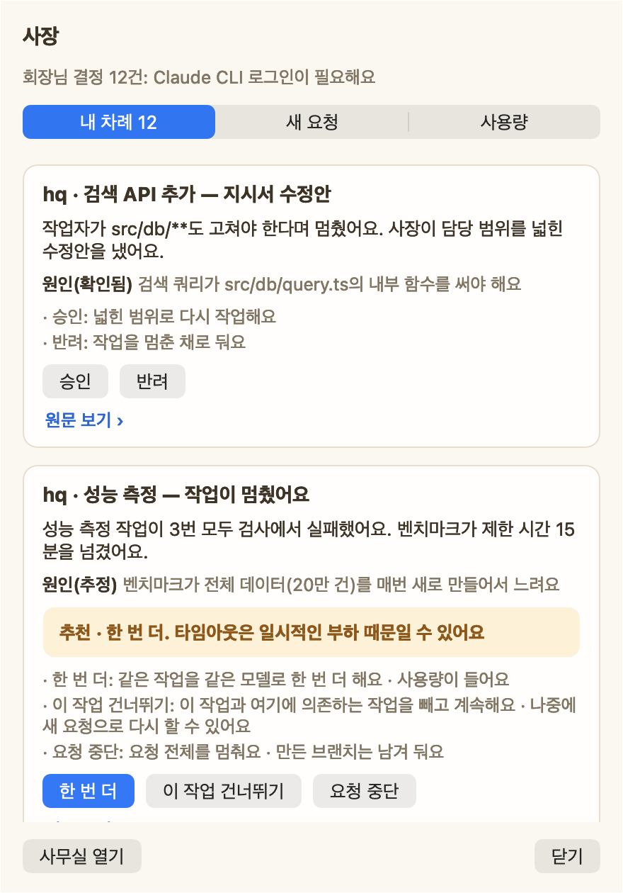
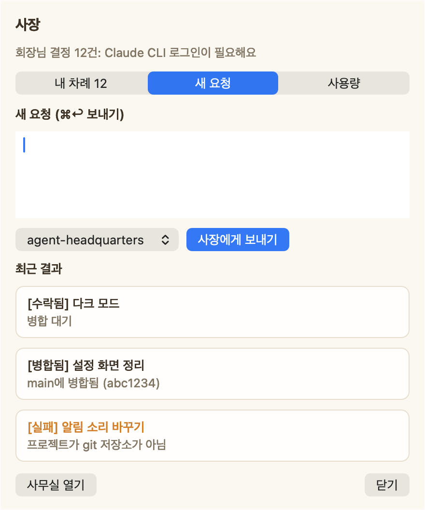
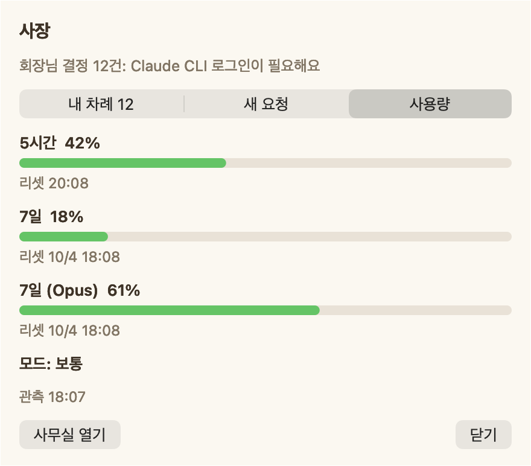
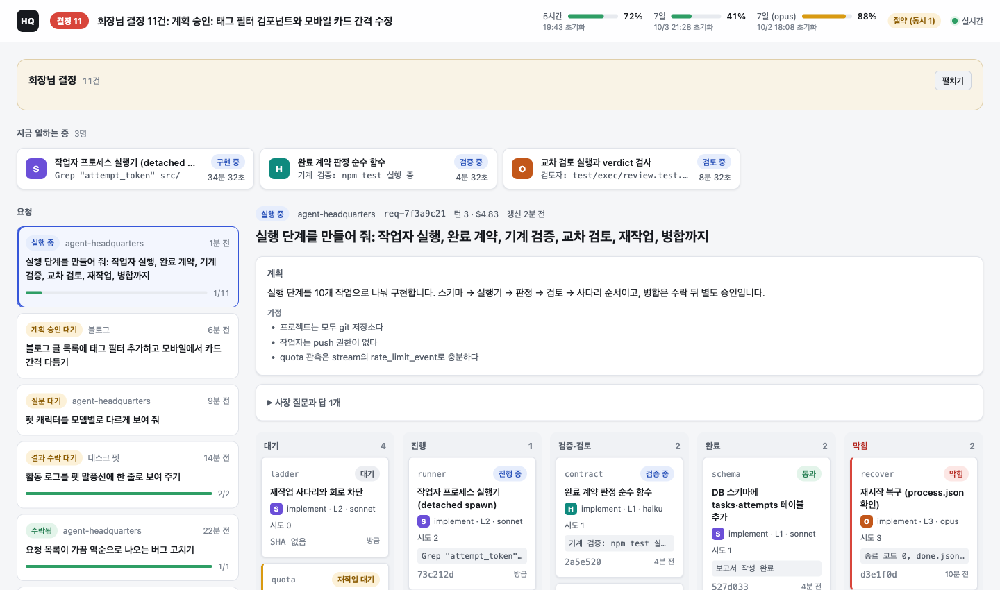

# agent-headquarters (hq) — 1인 AI 회사 본부

**나는 회장, Claude는 CEO, 작업은 팀이 한다.**
맥 한 대와 개인 Claude 구독으로 돌아가는 멀티 프로젝트 에이전트 오케스트레이터입니다. 진행 상황은 데스크톱 펫으로 봅니다.

<p align="center">
  
  <br><sub>펫의 사장 팝오버 · 결정이 필요한 순간에만 상황·원인·추천·선택지별 결과를 카드로 보여 줍니다</sub>
</p>

```
회장(나) ──요청──▶ CEO (Claude, 판단·계획·배정만)
                     │  질문 ≤3개 또는 계획+작업 지시서
                     ▼
               승인(해시 고정, 만료) ──▶ 작업 팀 (worktree별 Claude 작업자)
                                          │ 완료 계약 → 기계 검증 → 교차 검토
                                          ▼
                                   결과 수락 ──▶ 별도 병합 승인
```

## 화면
화면은 저장소의 목업 데몬(`test/pet/mock-daemon.ts`, `test/web/dev-server.ts`)으로 띄워 실제 코드에서 캡처했습니다. 펫 캐릭터는 스프라이트 없이 기본 아이콘으로 표시됩니다.

| 새 요청 | 사용량 |
| --- | --- |
|  |  |
| 한 줄로 요청하고 프로젝트를 고릅니다. 최근 결과(수락·병합·실패)도 함께 보입니다. | 구독 한도(5시간·7일·7일 Opus)와 리셋 시각, 현재 모드(보통·절약·보류)를 보여 줍니다. |


<sub>웹 화면(`hq open`) · 지금 일하는 작업자, 요청 목록, 사장의 계획·가정, 작업을 상태별 열(대기 · 진행 · 검증·검토 · 완료 · 막힘)로 보여 줍니다.</sub>

## 왜 만들었나
- 여러 에이전트 탭을 띄워 놓고 사람이 직접 지시·전달·확인하는 방식(Orca 등)은 사람이 병목이 됩니다.
- 사장(CEO)에게 한 줄로 지시하면 CEO가 팀을 꾸려 일하고, 사람은 **판단이 필요한 순간에만** 개입하는 구조를 원했습니다.
- 개인 구독 한도 안에서 돌아가야 하므로, 반복 작업은 코드(데몬)가 하고 모델 토큰은 판단에만 씁니다.

## 어떻게 믿을 수 있나
- **작업자는 macOS Seatbelt 안에서만 실행됩니다.** 작업자·검토자·검사 명령 모두 비밀 파일, hq 토큰·DB, 다른 작업자 경로, hq 제어 포트, `open`/`osascript`에 접근할 수 없습니다.
- **작업자의 "다 했어요"를 믿지 않습니다.** 완료 계약을 받은 뒤 hq가 전용 미러에서 수락 기준의 검사 명령을 직접 다시 돌려 판정합니다.
- **검토는 새 세션이 합니다.** 구현한 세션과 다른 새 작업자가 교차 검토하고, 검토자가 "실행했다"고 적은 테스트는 실제 스트림 기록과 정확히 일치하는지 대조합니다.
- **환경 실패를 '기존 실패'로 넘기지 않습니다.** 설정 실패·시간 초과·exit 126/127은 작업자를 띄우기 전에 멈추고, 기준선에서 실패했다는 이유로 검사를 면제하지 않습니다.
- **승인은 해시로 고정됩니다.** 회장이 본 계획·결과와 해시가 다르거나 승인 기한이 지나면 적용되지 않고, 늦게 도착한 응답은 새 상태를 덮지 못합니다.
- **병합은 회장 승인 후 `merge --ff-only`만** 합니다. 결과 수락과 병합 승인은 별도 단계입니다.
- **hq가 hq 자신을 고쳤습니다.** 그 과정에서 찾은 엔진 구멍(환경 실패를 기존 실패로 분류 등)과 수정 내역을 [개발 기록](docs/devlog.md#2026-09-30--hq가-hq를-고치다-dogfood)에 남겼습니다.

## 구성
| 부분 | 기술 | 역할 |
| --- | --- | --- |
| `src/` 데몬 | TypeScript (Node 내장 TS 실행, `node:sqlite`) | 요청 큐, CEO 턴, 승인, 팀 스케줄러, SSE 이벤트 |
| `pet/` 데스크 펫 | Swift (AppKit) | 바쁘거나 결정이 필요한 캐릭터만 화면에 표시, 클릭해서 요청·답변·승인 |
| `src/exec/` 실행 엔진 | TypeScript | 작업자 격리 실행, 검사, 검토, 재작업, 통합·병합, 한도 관리 |
| `src/web/`, `src/cli/` | TypeScript | 웹 화면, `bin/hq` 명령 |
| `skills/ceo.md` | 프롬프트 | CEO 규칙: 질문 기준, 등급(L0~L3), 역할×등급 모델 배정, 지시서 작성법 |

실측(이 맥, phys_footprint): 펫 약 15MB·CPU 약 2.5%, 데몬 약 45MB. 비교로 Tauri 158MB, Electron 189MB였습니다 → [결정 기록](docs/decisions/0002-stack.md).

## 현재 상태
- [x] 데몬: 요청 → CEO 질문/계획 → 해시 고정 승인
- [x] 펫: 캐릭터 줄·이름표(`프로젝트 · 작업 · 모델`)·말풍선, 사장 팝오버(내 차례 / 새 요청 / 사용량), 상황·원인·추천이 적힌 결정 카드
- [x] 작업자 실행: 작업자별 git 클론 + macOS Seatbelt 격리(비밀 파일·hq 데이터·네트워크 제어 포트 차단)
- [x] 완료 계약 → hq가 직접 돌리는 기계 검사 → 새 작업자의 교차 검토(실행한 테스트를 스트림과 대조)
- [x] 재작업 사다리(같은 모델 2회 → 한 단계 위, 3회 실패 시 멈춤), 사장의 지시서 수정·진단 카드
- [x] 결과 수락 → 통합 → 별도 병합 승인(`merge --ff-only`만), 구독 한도 절약/보류 모드, 로그인 만료 카드
- [x] 웹 화면(`hq open`), CLI(`hq doctor / install / status / logs`), 자동 시작(launchd)
- [x] 외부 구현 검토 2건(NO SIGN) → 샌드박스·판정·프로세스·팀·CLI 전면 수정(v4, 계약 §22, PR #10~#16)
- [x] hq가 hq 자신을 고침: 펫 말풍선 글자 크기 설정, 상황 문장 다듬기 (그 과정에서 찾은 엔진 구멍 3개 수정 → [개발 기록](docs/devlog.md))
- [x] 실제 요청 끝까지 성공: 연습 저장소에 "slugify 추가" → 계획 → 작업(Sonnet $0.064) → 검사 5개 통과 → 검토(Sonnet $0.038) → 수락 → ff 병합, 테스트 2/2 통과
- [x] 테스트 275개 통과(단위·웹·CLI·펫, `npm test`)

## 개발 과정
기능마다 브랜치와 PR로 진행합니다 → [PR 목록](https://github.com/dongmin1213/agent-headquarters/pulls?q=is%3Apr) · [개발 기록](docs/devlog.md) · [결정 기록](docs/decisions/)

## 실행
```bash
bin/hq projects add ~/code/my-app   # 관리할 프로젝트 등록
bin/hq install                      # 진단 → 펫 빌드 → 자동 시작 등록
bin/hq open                         # 웹 화면
npm test                            # 테스트 (단위·웹·CLI·펫)
```
자세한 설치·운영·문제 해결은 [SETUP](docs/SETUP.md), 실행 계약은 [설계 문서](docs/design/execution.md)에 있습니다.
요구 사항: macOS 14+, Node 26+, Claude Code CLI(로그인된 구독), Xcode Command Line Tools.

펫 스프라이트(포켓몬·디지몬)는 제3자 저작물이라 저장소에 포함하지 않습니다. `fetch-packs.sh`가 공개 스프라이트 저장소에서 개인 로컬 용도로 내려받습니다.
